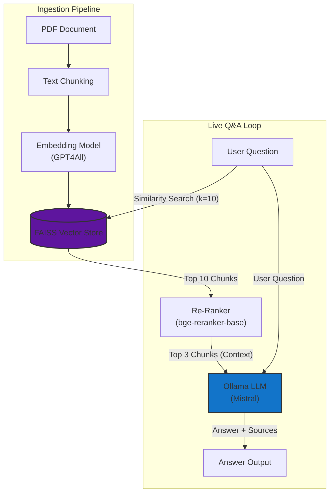

# PaperSense: AI Research Assistant

PaperSense is an intelligent, local-first application designed to help researchers, students, and professionals understand complex scientific documents. By leveraging a sophisticated Retrieval-Augmented Generation (RAG) pipeline, users can "chat" with their PDFs, asking nuanced questions and receiving accurate, source-verified answers.

This project goes beyond a standard RAG implementation by incorporating an advanced **two-stage retrieval process with a cross-encoder re-ranker** to ensure the highest quality context is provided to the language model.

## Key Features

-   **Interactive Chat Interface:** Upload one or more PDFs and ask questions in natural language.
-   **Local-First & Private:** Powered by Ollama and local models like Mistral, ensuring your documents and queries never leave your machine.
-   **Advanced Two-Stage Retrieval:**
    1.  **Fast Initial Search:** Uses a FAISS vector store for efficient semantic search.
    2.  **Intelligent Re-Ranking:** Employs a `BAAI/bge-reranker-base` cross-encoder to re-rank initial results for maximum relevance, significantly reducing noise.
-   **Trustworthy & Explainable:** Every answer is accompanied by a "View Sources" dropdown, showing the exact text chunks from the original document used to generate the response.
-   **Robust & Grounded:** Utilizes a carefully engineered prompt template to minimize hallucinations and force the LLM to answer only based on the provided context.

## Project Architecture

PaperSense is built on a modern, modular RAG architecture that emphasizes quality and control.



The data flows through the following pipeline:

1.  **PDF Ingestion:** Documents are loaded and parsed using `PyPDFLoader`.
2.  **Chunking:** Text is split into smaller, semantically meaningful chunks with `RecursiveCharacterTextSplitter`.
3.  **Embedding:** The text chunks are converted into numerical vectors using a local `GPT4AllEmbeddings` model.
4.  **Vector Storage:** The embeddings are stored in a `FAISS` in-memory vector store for fast retrieval.
5.  **Retrieval & Re-Ranking:**
    -   A user query triggers the `FAISS` store to retrieve the top 10 potentially relevant chunks (wide net).
    -   The `CrossEncoderReranker` then re-scores these 10 chunks for their specific relevance to the query, selecting the top 3.
6.  **Augmented Generation:** The top 3 re-ranked chunks are combined with the chat history and a strict prompt template, then fed to the `Ollama` (Mistral) LLM.
7.  **Answer & Sources:** The LLM generates an answer, which is then presented to the user along with the source chunks for verification.

## Tech Stack

-   **Backend & Orchestration:** Python, LangChain
-   **Large Language Model:** Ollama (with `mistral` model)
-   **UI Framework:** Streamlit
-   **Vector Store:** FAISS (Facebook AI Similarity Search)
-   **Embeddings & Re-Ranking:** `GPT4All`, `sentence-transformers`
-   **PDF Processing:** `PyPDF`

## Performance Evaluation

The RAG pipeline was evaluated on a curated set of questions from the "Attention Is All You Need" paper using the RAGAs framework. The evaluation was run entirely locally using the `mistral` model for both generation and judging.

The results demonstrate a high-quality, trustworthy, and precise system.

| Metric               | Average Score | Interpretation                                                                 |
| -------------------- | :-----------: | ------------------------------------------------------------------------------ |
| **Faithfulness**     |    `1.00`     | The model generated answers strictly from the context, with no hallucinations. |
| **Context Recall**   |    `1.00`     | The retriever successfully found all necessary information for every question. |
| **Answer Relevancy** |    `0.93`     | The answers were highly relevant and on-topic for the user's questions.        |

-   **Faithfulness & Context Recall:** Perfect scores here prove the system's reliability and the effectiveness of the two-stage retrieval with a re-ranker.
-   **Answer Relevancy:** A high score demonstrates the LLM's ability to generate concise, useful answers based on the high-quality context provided.

## Getting Started

### Prerequisites

-   Python 3.10+
-   [Ollama](https://ollama.com/) installed and running.

### Installation & Setup

1.  **Clone the repository:**

    ```bash
    git clone https://github.com/your-username/PaperSense.git
    cd PaperSense
    ```

2.  **Create and activate a virtual environment:**

    ```bash
    python -m venv venv
    source venv/bin/activate  # On Windows, use `venv\Scripts\activate`
    ```

3.  **Install dependencies:**

    ```bash
    pip install -r requirements.txt
    ```

4.  **Pull the necessary Ollama model:**
    ```bash
    ollama pull mistral
    ```

### Running the Application

1.  **Ensure Ollama is running** in a separate terminal.

2.  **Run the Streamlit app:**

    ```bash
    streamlit run app.py
    ```

3.  Open your web browser and navigate to `http://localhost:8501`.

## Future Work

-   **Support for More File Types:** Extend the document loader to handle `.docx`, `.txt`, and URLs.

## License

This project is licensed under the MIT License. See the [LICENSE](LICENSE) file for details.
