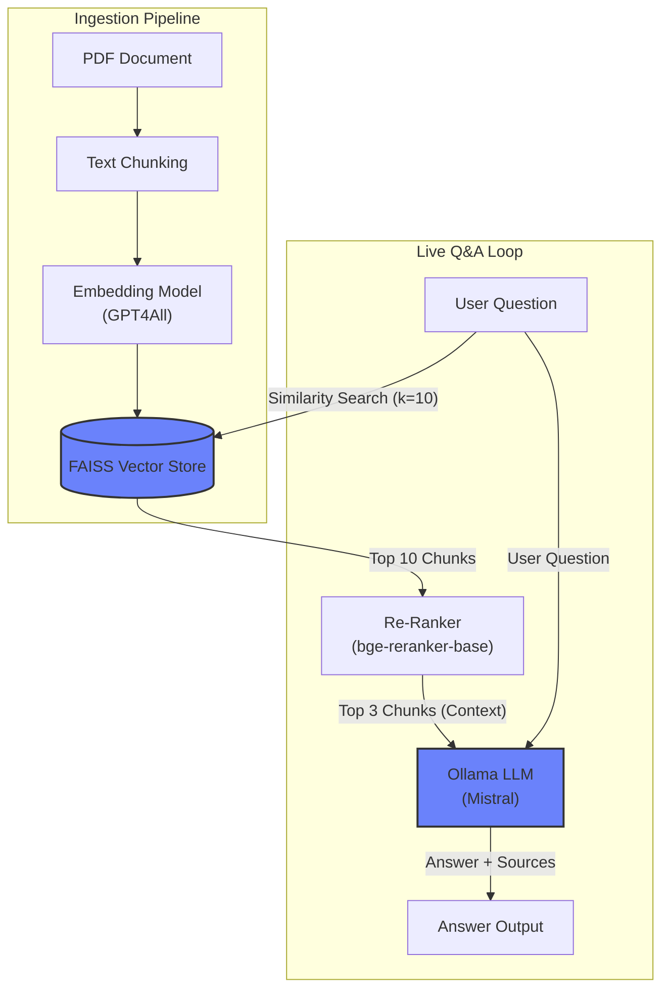

# 📚 PaperSense: AI Research Assistant

PaperSense is a sophisticated, local-first RAG application that allows you to chat with your documents. It goes beyond simple Q&A by using an advanced retrieval pipeline and offering dynamic, user-controlled outputs for a truly interactive research experience.


## Key Features

*   **Advanced RAG Pipeline:** Uses a two-stage retrieval process with a **FAISS** vector search followed by a **Cross-Encoder Re-Ranker** to provide highly accurate, noise-free context to the LLM.
*   **Dynamic Output Control:** Instantly change the AI's response **tone** (e.g., `Professional`, `ELI5`) and **language** through a simple UI, demonstrating advanced prompt engineering.
*   **Dual Summarization Modes:** Choose between a **"Quick Summary"** (intro/conclusion) and a **"Comprehensive Summary"** (full document) using different LangChain strategies (`stuff` vs. `refine`).
*   **100% Local & Private:** Runs entirely on your machine using **Ollama** and local models like `Mistral`. No data ever leaves your computer.
*   **Production-Ready:** Fully containerized with a multi-stage **Dockerfile**, ensuring a secure, reproducible, and easily deployable environment.

## Architecture Overview

The application uses a two-stage process: an initial **Ingestion Pipeline** that processes and embeds documents into a vector store, and a **Live Q&A Loop** that uses an advanced retrieval/re-ranking strategy to generate answers.



## Tech Stack

- **Python**
- **LangChain**
- **Streamlit**
- **Ollama** (running Mistral and other local LLMs)
- **Docker** (multi-stage containerization)
- **FAISS** (vector similarity search)
- **Sentence-Transformers** (including bge-reranker for re-ranking)

## Quick Start

### 1. Prerequisites
*   [Docker Desktop](https://www.docker.com/products/docker-desktop/) installed and running.
*   [Ollama](https://ollama.com/) installed and running.

### 2. Setup & Run

1.  **Clone the repository:**
    ```bash
    git clone https://github.com/Aravind-Sathesh/PaperSense.git
    cd PaperSense
    ```

2.  **Pull the required Ollama model:**
    ```bash
    ollama pull mistral
    ```

3.  **Build the Docker image:**
    ```bash
    docker build -t papersense .
    ```

4.  **Run the Docker container:**
    ```bash
    docker run -p 8501:8501 papersense
    ```

5.  Open your browser and go to `http://localhost:8501`.

## License

This project is licensed under the MIT License. See the [LICENSE](LICENSE) file for details.
